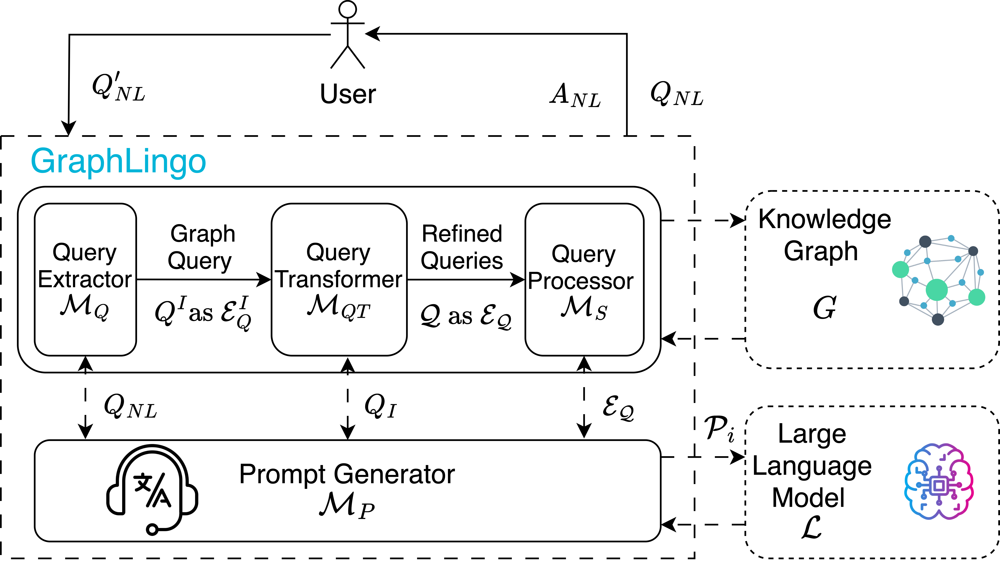
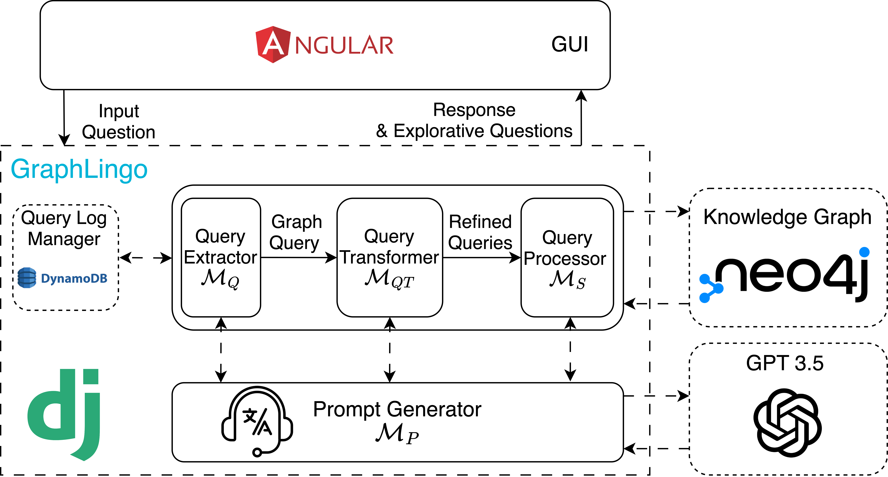

# GraphLingo
Domain Knowledge Exploration by Synchronizing Knowledge Graphs and Large Language Models.

This is a demo repo for the paper "GraphLingo: Domain Knowledge Exploration by
Synchronizing Knowledge Graphs and Large Language Models". If you want to run this demo, please contact the corresponding author at dhl64@case.edu to obtain necessary credetials to connect with the online knowledge graph and large language model.

The full version for the paper is available in the directory ``Docs/``
 ## Framework

 
 ## Architecture

